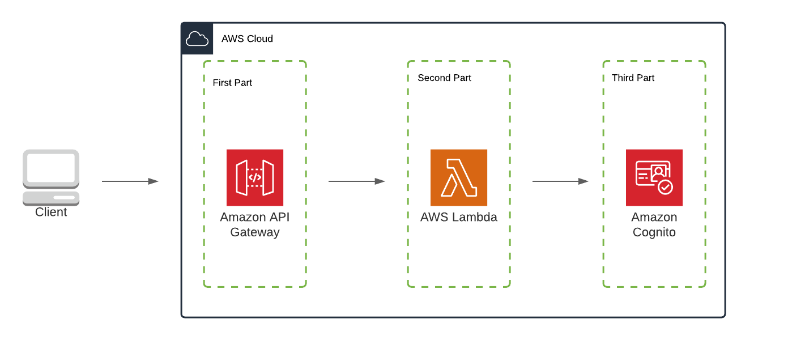
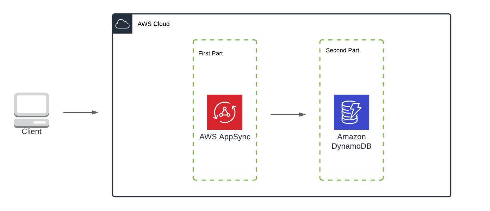
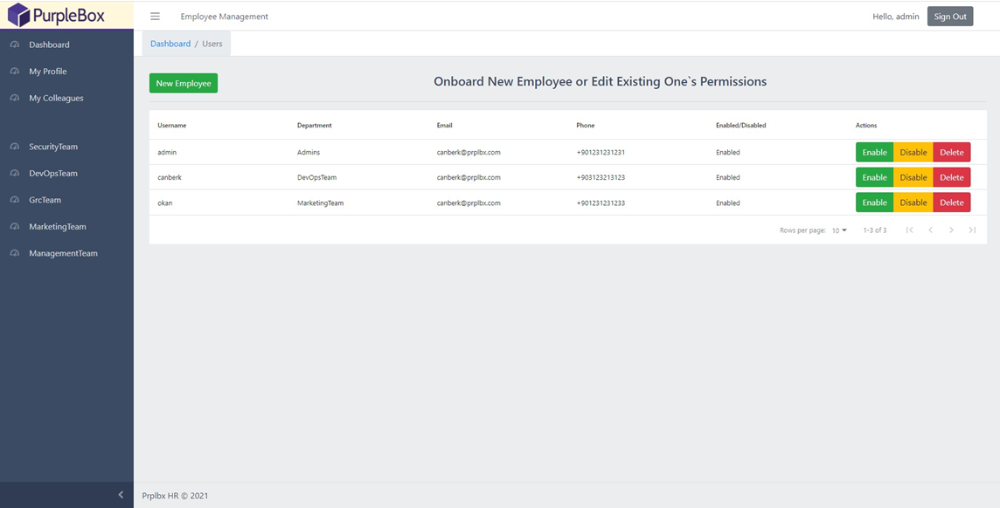

# HR Module Application

This project is build for implementing 2 serverless microservice patterns using AWS Amplify.
Full details can be found in Blog Posts Referance.

## Blog Posts Reference

| Blog Posts  
| -----------------
| [How to Create Web Apps with AWS Serverless Microservice Patterns [Part 1]](https://www.prplbx.com/resources/blog/aws-serverless-microservice-patterns/)
| [How to Create Web Apps with AWS Serverless Microservice Patterns [Part 2]](https://www.prplbx.com/resources/blog/aws-serverless-microservice-patterns-part2/)

## The Simple Web Service Pattern



## The Simple Graphql Service Pattern



## Demo

### Admin Action - Onboard New Employee



## Tech Stack

### Front End Development 💻

   

### Back End Development 📚

    

### Serverless & Cloud Development 🚀

      

### CI/CD & Hosting & Tools 📂

   

## Run Locally

Clone the project

```bash
  git clone https://github.com/PBCLOUD/HRModule
```

Go to the project directory

```bash
  cd prplbxHR
```

Install dependencies

```bash
  npm install
```

Initialize AWS Environment

```bash
  amplify init
```

Follow instructions on blog posts

[[Part 1]](https://www.prplbx.com/resources/blog/aws-serverless-microservice-patterns/)
[[Part 2]](https://www.prplbx.com/resources/blog/aws-serverless-microservice-patterns-part2/)

Start the server

```bash
  npm run start
```

## Feedback

If you have any feedback, please reach out to us at canberk@prplbx.com
